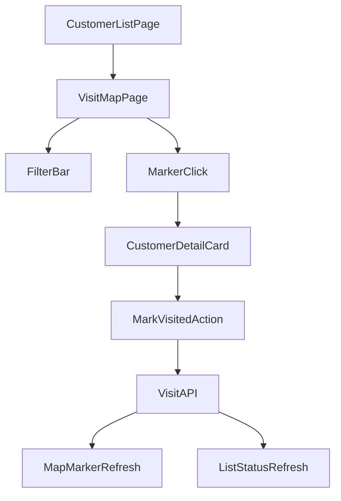

# 安卓拜访地图功能设计与实施计划

## 目标与范围

- 在现有“客户列表”基础上新增“拜访地图”入口与页面。
- 地图展示全部客户点位：红色=已拜访，蓝色=未拜访。
- 支持点击点位查看客户信息；未拜访客户可一键标记为已拜访。
- 支持地图筛选：距离范围、拜访状态（已/未/全部）。
- 支持用户当前位置展示、地图缩放与移动。

## 业务与交互方案

- 首页顶部增加 `拜访地图` 按钮，进入全屏地图页。
- 地图页默认行为：
  - 首次定位到“我的位置”附近并自适应展示客户点位。
  - 点位按状态着色：红色已拜访、蓝色未拜访。
  - 点击点位弹出底部卡片：姓名、公司、地址、距离、拜访状态。
- 点位详情交互：
  - 未拜访：显示 `标记为已拜访` 按钮。
  - 已拜访：显示拜访时间（可选支持“撤销拜访”，默认不开放）。
- 顶部筛选区：
  - 距离：`1km/3km/5km/10km/不限`。
  - 状态：`全部/未拜访/已拜访`。
  - （可选）按公司名称关键字搜索。

## 数据模型设计

- 客户主数据：`customerId, name, company, address`。
- 新增地理字段：`latitude, longitude, geocodeStatus, geocodeSource, geocodeUpdatedAt`。
- 拜访字段：`visitStatus(unvisited/visited), visitedAt, visitedBy`。
- 建议新增拜访记录表（审计）：`visitId, customerId, operatorId, action(mark_visited), ts, locationSnapshot`。

## 核心技术链路（高德地图）

- 使用高德 Android SDK：地图展示、定位、标记点渲染、聚合（客户数量大时）。
- 地址转经纬度（因当前只有地址）：
  - 后端批处理地理编码（优先），将坐标持久化。
  - 对失败地址标记 `geocodeStatus=failed`，进入人工修正或重试队列。
  - App 端仅消费已转好的坐标，避免端上频繁调用地理编码。
- 距离筛选：
  - 以“我的位置”为圆心计算客户距离（后端或端上二选一，优先端上计算+本地过滤，响应更快）。
- 标记拜访：
  - App 调用 `POST /customers/{id}/visit`。
  - 成功后本地立即更新点位颜色并刷新列表状态。

## 接口规划（建议）

- `GET /customers?status=&radiusKm=&centerLat=&centerLng=`
  - 返回客户基础信息 + 坐标 + 拜访状态 + 距离。
- `POST /customers/{id}/visit`
  - 入参：`operatorId, clientTime, clientLat, clientLng`。
  - 出参：最新拜访状态与时间。
- `POST /customers/geocode/batch`（后台任务接口）
  - 对无坐标客户批量补齐经纬度。

## 权限与异常处理

- 定位权限拒绝：允许继续看地图和客户点位，但距离筛选降级为“不可用/提示开启定位”。
- 地理编码失败：在列表与地图中显示“地址待校准”，不参与距离筛选。
- 网络失败：标记拜访按钮提供重试与幂等保护（避免重复提交）。

## 实施阶段与里程碑

- 第1阶段（后端数据准备）
  - 补充经纬度与拜访字段，跑首次批量地理编码。
- 第2阶段（Android 地图页）
  - 完成地图展示、点位着色、详情卡片、筛选与定位。
- 第3阶段（拜访状态闭环）
  - 打通标记拜访接口、状态回写、列表与地图联动。
- 第4阶段（优化与验收）
  - 聚合渲染、性能调优、异常场景、埋点与上线验收。

## 验收标准（UAT）

- 从列表进入地图成功率 100%。
- 点位颜色与拜访状态一致，状态切换后 1 秒内可见。
- 距离与状态筛选结果正确。
- 定位关闭、弱网、地理编码失败场景均可降级可用。
- 核心链路崩溃率满足发布标准。

## 流程图

