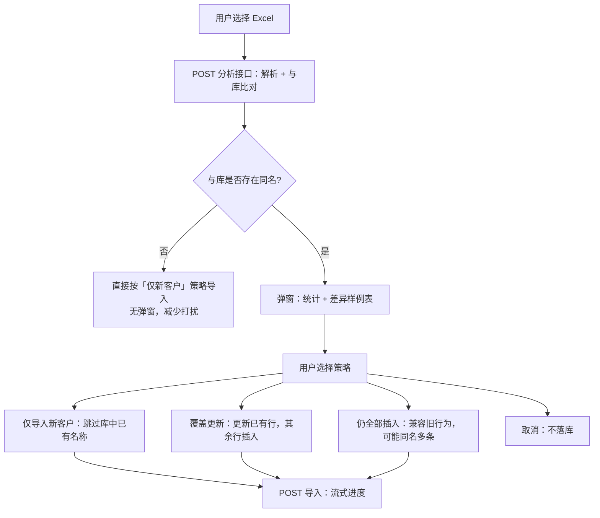

# 企业导入：重复检测、差异展示与「以最新为准」设计方案

## 1. 产品判断（是否采用「先确认再写入」）

**结论：推荐采用。** 重复导入时先 **分析 → 展示差异 → 用户选择策略 → 再落库**，能同时满足：

- **业务**：企业名称（Excel 列「客户名称」/ 库字段 `customerName`）在业务上应 **唯一**；重复导入时 **以本次文件为最新快照**，通过 **更新已有行** 或 **跳过重复** 表达意图，避免无声产生多条同名企业。
- **可控**：用户明确知道「会与库中哪条记录冲突」「字段级差异是什么」，减少误操作后的扯皮与对账成本。
- **性能**：分析阶段只做 **按需批量查询**，正式导入仍用 **批量插入 + 分批更新**，避免逐行先 `SELECT` 再 `INSERT` 的 N+1 模式。

当前 OMS **已实现**该思路的主干（见第 4 节与代码路径）；本文作为**独立设计说明**，便于评审、迭代和与业务对齐。

---

## 2. 业务原则（建议写进需求/培训）

| 原则 | 说明 |
|------|------|
| **唯一键（业务）** | **规范化后的企业名称** = Excel「**客户名称**」列经去首尾空白、合并连续空白后的字符串；与列表中的「企业名称」为同一数据。 |
| **以最新为准** | 用户选择 **「覆盖更新已存在客户」** 时：对库中已存在的同名企业，用 **本次 Excel 行** 覆盖可导入字段，并 **保留原记录 `id`**（便于 CRM 等外联不漂移）。 |
| **文件内多行同名** | 三 Sheet 按顺序拼接后，**同名保留最后一行**（与「后出现的覆盖前一行」一致），再在库维度做重复检测。 |
| **库内历史多条同名** | 若历史上已存在多条同名（未清理），当前实现以 **`id` 最大** 的一条作为更新目标；长期建议数据治理或加 **唯一约束**（见第 7 节）。 |

---

## 3. 交互流程（用户体验）

**体验要点：**

- **无重复时**：一步完成导入，不强制弹确认（保证日常大批量首次导入顺畅）。
- **有重复时**：必须 **显式选择** 策略后再写入，避免默认静默产生重复或误覆盖。
- **差异展示**：按「样例条数上限 + 每行差异字段上限」截断，避免超大 JSON 拖垮浏览器；全文差异可通过导入后列表/导出再核对。

---

## 4. 与当前实现对齐（实现清单）

| 环节 | 行为 | 代码/API 参考 |
|------|------|----------------|
| 规范化键 | `normalizeCustomerKey` | `src/lib/enterprise-import-dedupe.ts` |
| 文件内去重 | 同名保留最后一行 | 同上 `dedupeWithinFileLastWins` |
| 分析 | 批量查库 + 样例差异 | `POST /api/enterprises/import/analyze` |
| 导入模式 | `skip_existing` / `upsert` / `insert_all` | `POST /api/enterprises/import` 表单字段 `importMode` |
| 前端 | 分析 → 弹窗 → 带 `importMode` 再导入 | `dashboard/enterprises/EnterprisesManagement.tsx` |

**默认建议：**

- 无库内重复：服务端默认走 **仅新客户**（与「不主动覆盖」一致）。
- 有库内重复：由用户在弹窗中选择；**推荐主按钮「以本次 Excel 为准覆盖更新」**（对应 `importMode=upsert`），与「以最新导入为准」一致；另可选仅新客户、仍全部插入（旧行为）或取消。

---

## 5. 性能设计

### 5.1 分析阶段

- **输入**：本次解析后的去重行集合上的 **规范化名称列表**（去重后规模 ≤ 行数）。
- **查库**：使用 `WHERE TRIM(customerName) IN (...)` **分批 IN**（每批约数十～上百个键，避免单条 SQL 过长），只拉取 **命中行**；**不做全表扫描**。
- **说明**：`TRIM(customerName)` 可能无法完全利用 `customerName` 普通索引；数据量到 **十万级以上** 时，可考虑 **生成列 + 索引**（规范化名称存一列）或 **异步任务 + 结果缓存**，作为后续优化项。

### 5.2 写入阶段

- **新增**：`createMany` **分批**（如每批 500 行）。
- **更新**：`upsert` 语义下对「已存在 id」做 `update`，**分批并发**（如每批数十条 `Promise.all`），控制连接池压力。
- **事务**：同一导入批次在 **单事务** 内创建 `EnterpriseImportBatch` 并写入/更新子表，保证批次一致性。

### 5.3 前端与载荷

- 分析接口返回 **样例条数上限**、**每条差异字段数上限**，避免一次返回兆级 JSON。
- 导入仍用 **NDJSON 流式进度**，大文件不阻塞 UI 假死。

---

## 6. 数据与一致性

- **更新保留 `id`**：CRM 陌拜地图等若按 `enterprise_records.id` 关联，覆盖更新不会换 id，风险低于「删后插」。
- **批次维度**：每次导入仍生成 **`EnterpriseImportBatch`**；更新行会 **改 `batchId` 指向新批次**，表示「最近一次来自哪次导入」，需在报表中约定是否按批次看历史（若需严格历史版本，后续可单独做快照表，非本方案必选）。

---

## 7. 后续可选增强

| 方向 | 说明 |
|------|------|
| **库表唯一约束** | 在数据治理完成后，对 `customerName` 或「规范化名称列」加 **UNIQUE**，从库层杜绝重复；上线前需清洗历史重复行。 |
| **组合键** | 若业务要求「企业名称 + 地市」等同名不同主体，可将唯一键扩展为组合条件（需改分析与导入逻辑）。 |
| **异步导入** | 超大文件可走队列，分析结果以通知/任务详情页展示，避免 HTTP 超时。 |
| **审计日志** | 对 `upsert` 记录变更前后摘要，满足合规与对账。 |

---

## 8. 文档关系

- **模板列变更、迁移、上线流程**：见 [enterprise-excel-schema-evolution.md](./enterprise-excel-schema-evolution.md)。
- **本文**：专注 **重复导入的产品与工程方案**（检测、交互、性能、演进）。

建议在 OMS README 或内部 Wiki 中 **同时链到两篇**，避免只读其一产生误解。
